# PROPUESTA DE DISEÑO INTEGRAL: SARTORIA

---

## SECCIÓN A — SISTEMA DE DISEÑO (Design System)

### 1. Paleta de Colores
**Colores Primarios & Acento**
- **Primario (Negro Premium):** `#0a0a0a` (Fondos principales, Headers, Botones primarios)
- **Secundario (Gris Carbón):** `#1a1a1a` (Tarjetas, Paneles laterales)
- **Acento (Oro Real):** `#d4af37` (Iconos activos, badges premium, enlaces hover, bordes foco)
- **Acento Suave (Champagne):** `#f3e5ab` (Fondos de iconos, hovers sutiles)

**Colores de Fondo**
- **Fondo Claro (App/Light Mode):** `#ffffff`
- **Fondo Gris Suave (Secciones secundarias):** `#f9f9f9`
- **Fondo Oscuro (Landing/Dark Mode):** `#0a0a0a`
- **Surface/Card (Light):** `#ffffff` (con borde sutil o sombra)
- **Surface/Card (Dark):** `#1a1a1a`

**Colores de Texto**
- **Principal:** `#0a0a0a` (Light Mode), `#ffffff` (Dark Mode)
- **Secundario:** `#4b5563` (Gray-600 - Light), `#9ca3af` (Gray-400 - Dark)
- **Muted/Deshabilitado:** `#9ca3af` (Gray-400)
- **Invertido:** `#ffffff` (Texto sobre botones negros)

**Colores de Estado**
- **Éxito (Aprobado):** `#059669` (Green-600) / Fondo: `#ecfdf5`
- **Error (Alerta):** `#dc2626` (Red-600) / Fondo: `#fef2f2`
- **Advertencia (Pendiente):** `#d97706` (Amber-600) / Fondo: `#fffbeb`
- **Info (Neutral):** `#2563eb` (Blue-600) / Fondo: `#eff6ff`

### 2. Tipografía
**Fuente Títulos: Playfair Display**
- **H1 (Hero):** 64px / Bold / 1.1 (Tracking -0.02em)
- **H2 (Secciones):** 40px / Medium / 1.2
- **H3 (Cards/Modales):** 24px / Medium / 1.3
- **H4 (Subtítulos):** 20px / Regular / 1.4

**Fuente Cuerpo: Inter**
- **Body Large:** 18px / Regular / 1.6
- **Body Regular:** 16px / Regular / 1.5
- **Body Small:** 14px / Regular / 1.5
- **Caption:** 12px / Medium / 1.5 (Uppercase tracking wide)

**Fuente Interfaz (Botones/Labels): Inter**
- **Button Text:** 16px / Medium / Tracking normal
- **Nav Label:** 12px / Medium / Tracking normal

### 3. Componentes Reutilizables

**Botones**
- **Primario:** `bg-[#0a0a0a] text-white rounded-xl hover:bg-[#2a2a2a] shadow-lg`
- **Secundario:** `bg-white text-[#0a0a0a] border border-gray-200 rounded-xl hover:bg-gray-50`
- **Acento (Premium):** `bg-[#d4af37] text-white rounded-xl hover:bg-[#b5952f]`
- **Ghost:** `bg-transparent text-[#0a0a0a] hover:bg-gray-100 rounded-lg`
- **Disabled:** `bg-gray-200 text-gray-400 cursor-not-allowed`

**Inputs**
- **Text:** `bg-gray-50 border-0 rounded-xl px-4 py-3 text-gray-900 focus:ring-2 focus:ring-[#d4af37]`
- **Select:** `bg-white border border-gray-200 rounded-xl px-4 py-3`
- **Toggle:** Switch estilo iOS con color activo `#0a0a0a`.

**Cards**
- **Producto/Prenda:** Simple, sin bordes visibles (`border-0`), fondo de imagen `bg-gray-50`, esquinas `rounded-xl`. Sombra `hover:shadow-premium`.
- **Outfit:** Estilo polaroid o container limpio, con footer de información.
- **Plan:** Borde destacado para el recomendado (`border-[#d4af37]`).

**Badges & Pills**
- **Estado (Pill):** `rounded-full px-3 py-1 text-xs font-medium uppercase tracking-wider`.
- **Ocasión (Chip):** Inactivo (`bg-gray-50 text-gray-500`), Activo (`bg-black text-white`).

### 4. Iconografía
- **Librería:** Lucide React (`stroke-width={1.5}` para elegancia).
- **Estilo:** Línea fina, minimalista.

### 5. Espaciado
- Sistema base 4px.
- **Márgenes secciones:** 64px - 96px.
- **Gap tarjetas:** 16px - 24px.
- **Padding contenedores:** 24px (Móvil), 48px (Desktop).

### 6. Bordes y Sombras
- **Radio:** `rounded-xl` (12px) estándar. `rounded-2xl` (16px) para contenedores grandes.
- **Sombra Premium:** `0 20px 40px -4px rgba(0, 0, 0, 0.08)` (Suave, difusa).

---

## SECCIÓN B — NAVBAR Y NAVEGACIÓN

### 1. Navbar Superior (App)
- **Logo:** `SARTORIA.IA` (Playfair) a la izquierda.
- **Derecha:**
  - **Badge Premium:** Pill dorado `PREMEIUM`.
  - **Idioma:** Toggle `ES | EN`.
  - **Avatar:** Círculo 32px con foto de usuario (dropdown menu).

### 2. Bottom Tabs (Móvil) / Sidebar (Desktop)
- **Tabs:** 5 Elementos clave.
  1. **Inicio** (Icono: `Home`) - Atuendo del día.
  2. **Armario** (Icono: `Shirt`) - Catálogo.
  3. **Plan** (Icono: `Calendar`) - Semanal.
  4. **Análisis** (Icono: `BarChart`) - Estadísticas.
  5. **Perfil** (Icono: `User`) - Configuración.
- **Estado Activo:** Icono lleno o línea inferior, color negro. Inactivo gris.

---

## SECCIÓN C — PANTALLAS (Detalle)

### C1. LANDING PAGE
- **Hero:** Fondo oscuro inmersivo (`bg-gray-900`). Foto modelo alta costura. Titular blanco Playfair. CTA "Empezar ahora" (Blanco).
- **Cómo funciona:** 3 pasos con iconos grandes en círculos dorados suaves.
- **Features:** Grid 2x2. Iconos minimalistas.
- **Precios:** 2 Tarjetas (Mensual / Anual). Anual destacada con borde dorado "Mejor Valor".
- **Footer:** Minimalista. Enlaces legales y redes.

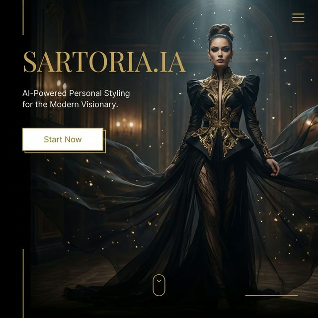

### C2. LOGIN
- **Layout:** Centrado limpio.
- **Elementos:** Logo grande. "Bienvenido de nuevo". Botón "Google" (Outline). Formulario email/pass minimalista.
- **CTA:** Botón negro ancho completo "Iniciar sesión".

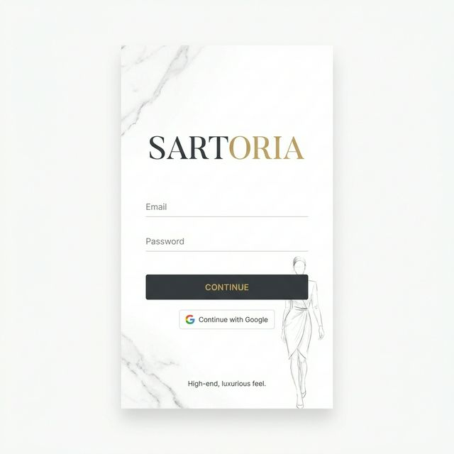

### C3. REGISTRO
- Igual que Login pero con campo "Nombre".
- Enfocado en conversión rápida.

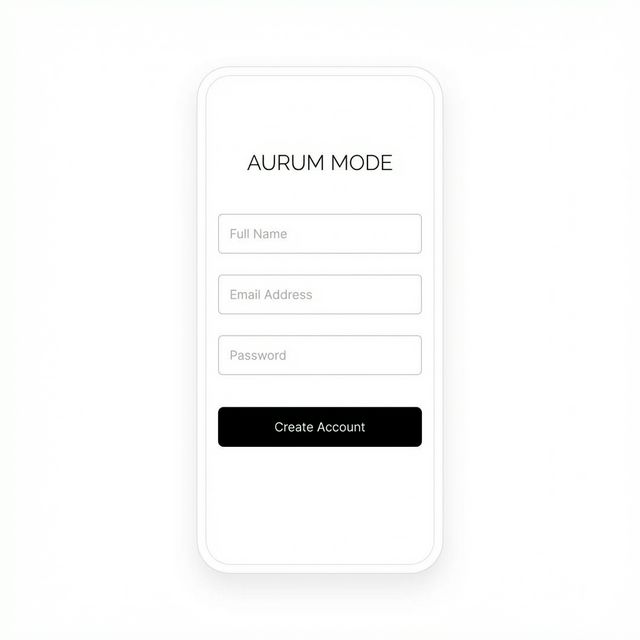

### C4. ONBOARDING
- **Paso 1 (Ciudad):** Input grande buscador.
- **Paso 2 (Estilos):** Grid de imágenes seleccionables (Business, Casual, Streetwear, Old Money...).
- **Paso 3 (Foto):** Área de dropzone grande o "Usar modelo".
- **Paso 4 (Listo):** Animación de check.

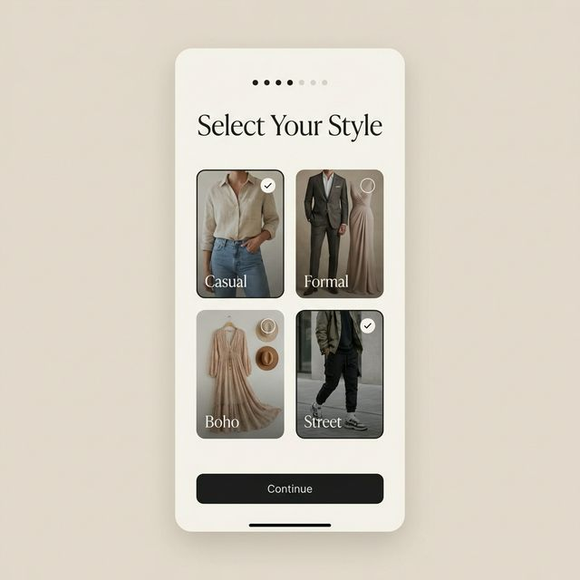

### C5. ATUENDO DEL DÍA (Dashboard)
- **Header:** Widget clima flotante con glassmorphism. Saludo "Hola, Nano".
- **Centro:** Tarjeta de Outfit enorme. Foto del modelo (Nano Banana) vistiendo la ropa (Traje, Blazer, etc.).
- **Controles:** Slider de ocasión (Trabajo, Cita, Gym...) horizontal.
- **Acción:** Botón flotante o inferior "Generar nuevo".

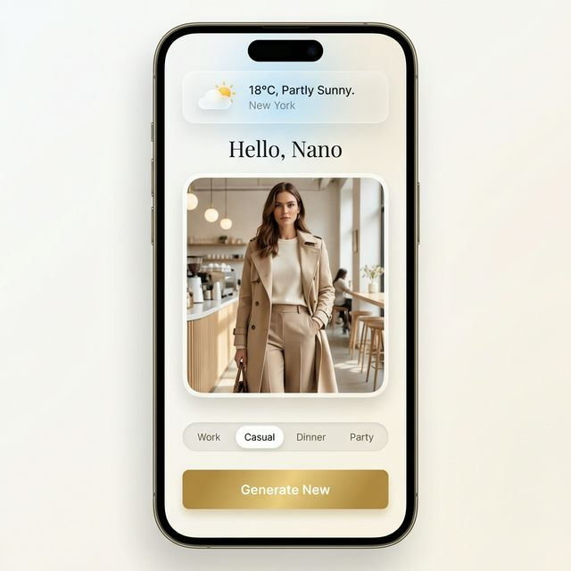

### C6. MI ARMARIO
- **Cabecera:** "Mi Armario (42 prendas)". Filtros chips horizontales (Camisas, Pantalones, Zapatos...).
- **Grid:** Tarjetas limpias sin bordes. Foto prenda + Marca + Talla.
- **Acción:** FAB (+) Flotante abajo derecha para añadir.

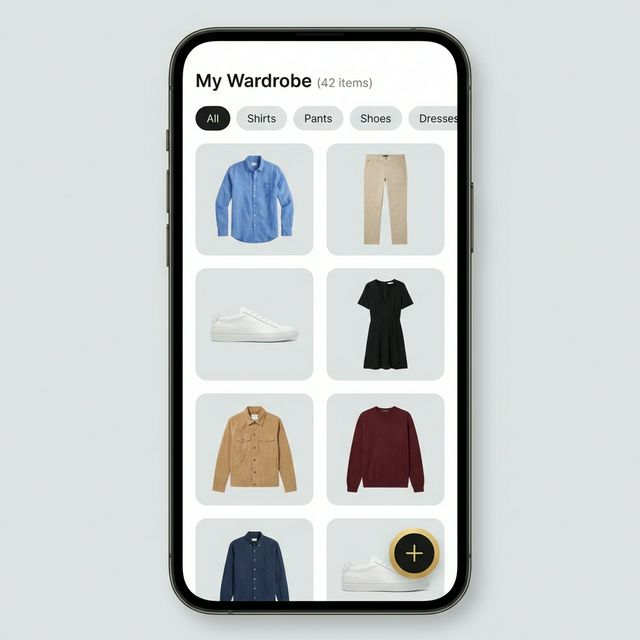

### C7. PLANIFICACIÓN SEMANAL
- **Vista:** Columnas por día (Lun-Dom).
- **Tarjetas:** Cada día tiene una miniatura del outfit programado y el clima previsto.
- **Estado:** Badges "Aprobado" (Verde) o "Sugerido" (Gris).
- **Footer:** Sticky bar "Aprobar Semana".

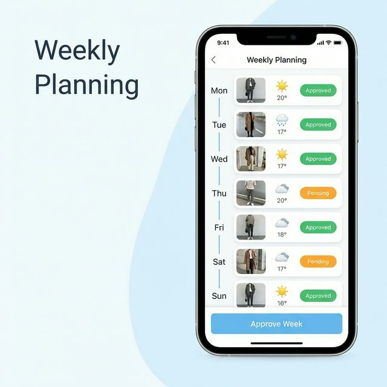

### C8. HISTORIAL
- **Lista:** Timeline vertical.
- **Items:** Fecha a la izquierda, foto outfit a la derecha. Badge de ocasión.
- **Interacción:** Click para ver detalle o "Repetir outfit".

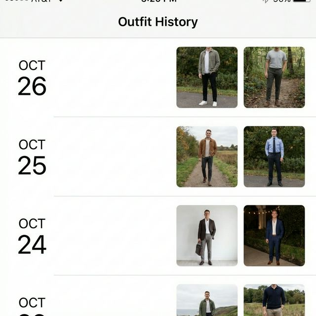

### C9. ANÁLISIS
- **KPIs:** Cards superiores (Total valor, prendas sin uso).
- **Gráficos:** Donut chart (Distribución colores), Bar chart (Uso por categoría).
- **Insights:** Texto generado por IA "Deberías comprar más básicos...".

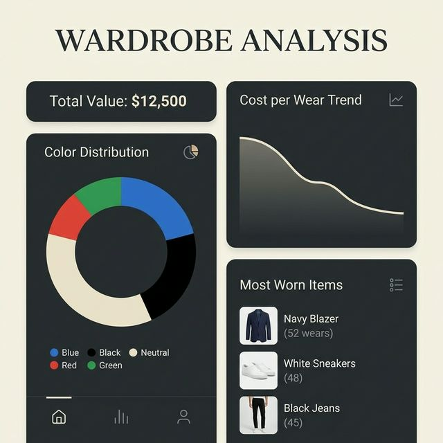

### C10. MALETA DE VIAJE
- **Form:** Input "Destino" (Paris), "Fechas" (Selector rango).
- **Resultado:** Lista de prendas agrupada (Bottoms, Tops, Calzado). Checkbox para ir marcando mientras empacas.

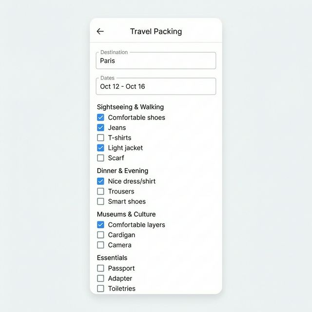

### C11. PERFIL
- **Header:** Foto circular grande, Nombre, Plan actual.
- **Lista:** Opciones estilo iOS (Icono + Texto + Chevron).
  - Suscripción
  - Preferencias de estilo
  - Medidas
  - Cerrar sesión (Rojo)

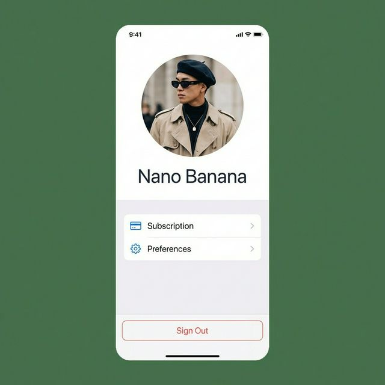

### C12. PAYWALL (Trial Expirado)
- **Diseño:** Fondo oscuro o imagen desenfocada. Contenido centrado modal.
- **Copy:** "Tu estilo no tiene límites". "Desbloquea todo".
- **Opciones:** Toggle Mensual/Anual.
- **CTA:** Botón dorado "Suscribirse ahora".

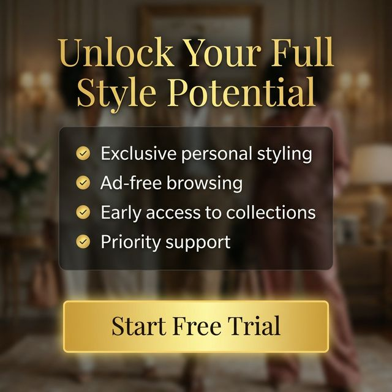

---

## SECCIÓN D — ESTADOS GLOBALES
- **Loading:** Esqueletos pulsantes (shimmer) gris claro.
- **Error:** Toast rojo en parte superior.
- **Empty:** Ilustración lineal simple + Texto "No hay nada aquí" + Botón acción.

## SECCIÓN E — RESPONSIVE
- **Móvil:** Nav inferior. Grids 1-2 columnas.
- **Desktop:** Nav lateral izquierda. Grids 3-4 columnas. Contenedor centrado max-w-7xl.
